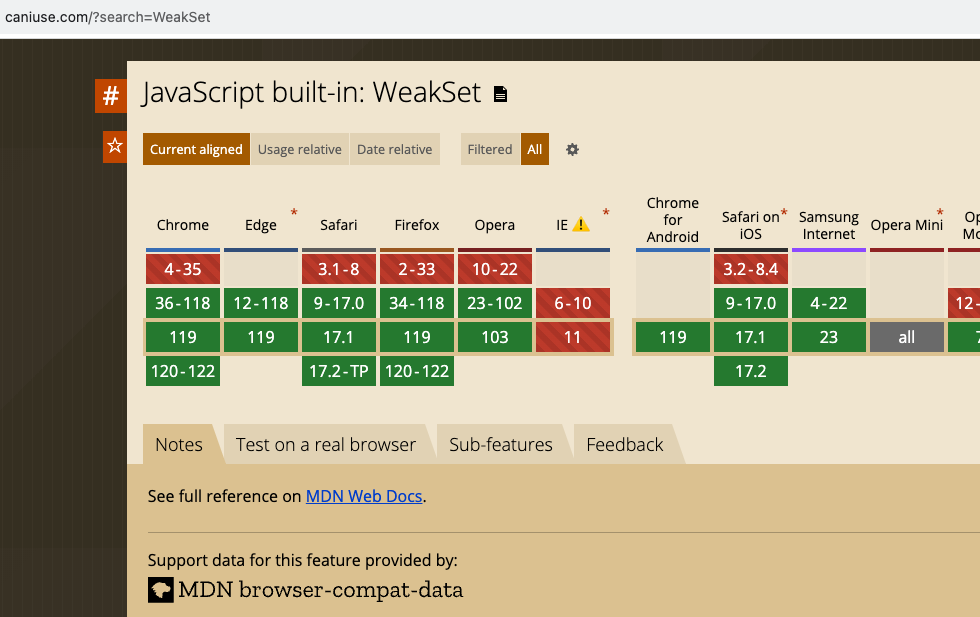
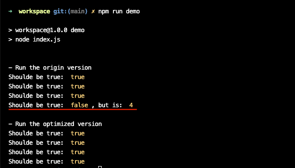

# CodeSandbox Demo

## Problem

The origin version has a problem when the function body has the same structure, see the belowing

```javascript
const listener = function () {
    arguments.callee.count = (arguments.callee.count || 0) + 2;
}

const listener2 = function () {
    arguments.callee.count = (arguments.callee.count || 0) + 2;
}

// ...
```

## My resolution

Use the WeakSet to distinguish listeners that have the same function body or more.

### WeakSet

, see [#](https://caniuse.com/?search=WeakSet) for detail

### Demo

Run 

```shell
npm run demo
```


